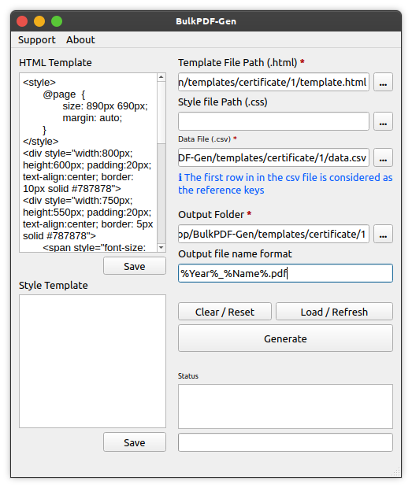
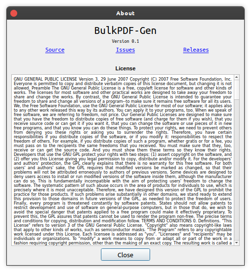

# 

<p align="center">
<a href="https://github.com/amannirala13/BulkPDF-Gen/issues"></a>
<a href="https://github.com/amannirala13/BulkPDF-Gen/pulls"></a>
<a href="https://github.com/amannirala13/BulkPDF-Gen/network/members"></a>
<a href="https://github.com/amannirala13/BulkPDF-Gen/stargazers"></a>
<a href="https://github.com/amannirala13/BulkPDF-Gen/watchers"></a>
<a href="https://github.com/amannirala13/BulkPDF-Gen/archive/master.zip"></a>
<a href="https://www.codefactor.io/repository/github/amannirala13/bulkpdf-gen"></a>
<a href="https://www.codacy.com/gh/amannirala13/BulkPDF-Gen/dashboard?utm_source=github.com&amp;utm_medium=referral&amp;utm_content=amannirala13/BulkPDF-Gen&amp;utm_campaign=Badge_Grade"></a>
<a href="https://app.fossa.com/projects/git%2Bgithub.com%2Famannirala13%2FBulkPDF-Gen?ref=badge_shield"></a></img></a>
</p>

A bulk html pdf generator. This application can generate PDFs in bulk by using just one click.

<p align="center">
<h2 align="center">Screenshots</h2>
<table>
<tr>
<th></h>
<th></th>
<tr>
</table>
</p>

## Requirements 🧱

Your system must have the following tools installed and setup with system path variables updated before you can use this software.

- **Python3**
- **pip package manager**
- **GTK3 Runtime** _(for Windows, MacOS and few linux based systems)_.
  You can get GTK form here 👉 [For Windows](https://www.gtk.org/docs/installations/windows/), [For MacOS](https://www.gtk.org/docs/installations/macos/), [For Linux](https://www.gtk.org/docs/installations/linux/)
  > Note: Your system might already have gtk3 installed. You need not install gtk dev dependencies.

## Getting started 🚀

To run the application from the source code you need to meet few basic requirements. Once that is done we are ready to do the setup.

To prepare the environment you need to follow these steps:

- Execute the `prep.sh` script which will make virtual environment. Here is an example for debian based system:

  ```sh
  $ chmod +x prep.sh
  $ ./prep.sh
  ```

- Now we can activate the environment. Here is an example:

  - For Unix or MacOS based system:

    ```sh
    $ source env/bin/activate
    ```

  - For Windows based system:

    ```bat
    $ env\Scripts\activate.bat
    ```

    > Note: Your `pwd` must be the `src` directory or else you need to provide full path of the `activate` script.

  - To deactivate use the following command:
    ```sh
    $ deactivate
    ```

- Now we are ready to install the required packages. Run the following command to install all the required packages:

  ```sh
  $ pip install -r requirements.txt
  ```

- Once we are done with installing packages. We are ready to execute the application using python. Here is an example:
  ```sh
  $ python app.py
  ```

> Note: To run this software successfully you need to make sure you have **GTK3** installed.

## How to use? 💡

When the application is launched it has a single window with a few but important options. The application uses special syntax to generate customized content. Lets have a brief walk through it:

The application uses HTML and CSS to render document designs. We have provided some pre-build templates but feel free to load your custom design.

### Template variable syntax 🔥

To make the document generation versatile and make customization possible we added a variable syntax in system for the templates which will be used to render real value from the data file.

- A variable is surrounded by **`%`**.
  > Example: `%label%`
- A label is the column name of the data file. It is the **first row** of the **`.csv`** file.

<table>
<tr>
<th>Number</th>
<th>Alpha</th>
<th>Beta</th>
<th>Gamma</th>
<td style="color:red">👈 These are the labels</td>
</tr>
<tr>
<td>1</td>
<td>100</td>
<td>40</td>
<td>0.5</td>
</tr>
<tr>
<td>2</td>
<td>90</td>
<td>80</td>
<td>0.7</td>
</tr>
<tr>
<td>3</td>
<td>150</td>
<td>20</td>
<td>0.1</td>
</tr>
<table>

> Note: Labels are case sensitive.

#### Here is an example

**template.html**

```html
<style>
  @page {
    size: 890px 690px;
    margin: auto;
  }
</style>
<div
  style="width:800px; height:600px; padding:20px; text-align:center; border: 10px solid #787878"
>
  <div
    style="width:750px; height:550px; padding:20px; text-align:center; border: 5px solid #787878"
  >
    <span style="font-size:50px; font-weight:bold"
      >Certificate of Completion</span
    >
    <br /><br />
    <span style="font-size:25px"><i>This is to certify that</i></span>
    <br /><br />
    <span style="font-size:30px"><b>%Name%</b></span
    ><br /><br />
    <span style="font-size:25px"><i>has completed the course</i></span>
    <br /><br />
    <span style="font-size:30px">%Course%</span> <br /><br />
    <span style="font-size:20px">with score of <b>%Score%</b></span>
    <br /><br /><br /><br />
  </div>
</div>
```

<table>
<tr>
<b>data.csv</b>
</tr>
<tr>
<th>Name</th>
<th>Course</th>
<th>Score</th>
<td style="color:red">👈 These are the labels</td>
</tr>
<tr>
<td>Aman Nirala</td>
<td>Quantum Information</td>
<td>95</td>
</tr>
<table>

**PDF output**


### Steps to use 🧐

1. Select your `HTML` template file in the application _(this file is important)_.
2. Select `style(css)` file for additional design customization _(optional)_.
3. Then choose your data file`(.csv)`.
   > Note: The data file needs to be a `.csv` i.e. `comma(,)` separated file. The first row is considered as **`"label"`** information and not data instance. This is important as this `"label"` will be used in the template file as **`variables`**.
4. Next you need to define an output file name format. This is optional, you can leave is empty and it will auto-generate file name based on the data.
   > Note: You have to follow variable syntax format for defining file name. Here is an example: `%label-1%_MIT_%label-2%.pdf`.
5. Now you need to select the output directory in which all the documents will be saved.
6. Finally it's time to do a final check and tweaks before staring the document generation process._(Don't forget to save the changes made to the template or style files in the application before starting to process.)_
7. Once everything is done, press the `Generate` button and wait for the program to finish the process.

## License

[](https://app.fossa.com/projects/git%2Bgithub.com%2Famannirala13%2FBulkPDF-Gen?ref=badge_large)

## Contributors ✨

<!-- ALL-CONTRIBUTORS-BADGE:START - Do not remove or modify this section -->

[](#contributors-)

<!-- ALL-CONTRIBUTORS-BADGE:END -->

Thanks goes to these wonderful people ([emoji key](https://allcontributors.org/docs/en/emoji-key)):

<!-- ALL-CONTRIBUTORS-LIST:START - Do not remove or modify this section -->
<!-- prettier-ignore-start -->
<!-- markdownlint-disable -->
<table>
  <tr>
    <td align="center"><a href="https://amannirala.com/"><br /><sub><b>Aman Nirala</b></sub></a><br /><a href="https://github.com/amannirala13/BulkPDF-Gen/commits?author=amannirala13" title="Code">💻</a> <a href="https://github.com/amannirala13/BulkPDF-Gen/commits?author=amannirala13" title="Documentation">📖</a> <a href="#ideas-amannirala13" title="Ideas, Planning, & Feedback">🤔</a> <a href="#design-amannirala13" title="Design">🎨</a></td>
  </tr>
</table>

<!-- markdownlint-restore -->
<!-- prettier-ignore-end -->

<!-- ALL-CONTRIBUTORS-LIST:END -->

This project follows the [all-contributors](https://github.com/all-contributors/all-contributors) specification. Contributions of any kind welcome!

---

<p align="center">
<a href="https://github.com/amannirala13?tab=followers"></a>
<a href = "https://twitter.com/AmanNirala13"></a>
</p>

<p align="center">
<a href="https://www.facebook.com/amannirala13"></a>
<a href="https://www.linkedin.com/in/amannirala13"></a>
<a href="https://www.researchgate.net/profile/Aman_Nirala"></a>

</p>

If you like our work, a bit of contribution would motivate us a lot for more open source contributions.

<p align="center">
<a href="https://www.paypal.me/amannirala13"></a>
</p>
